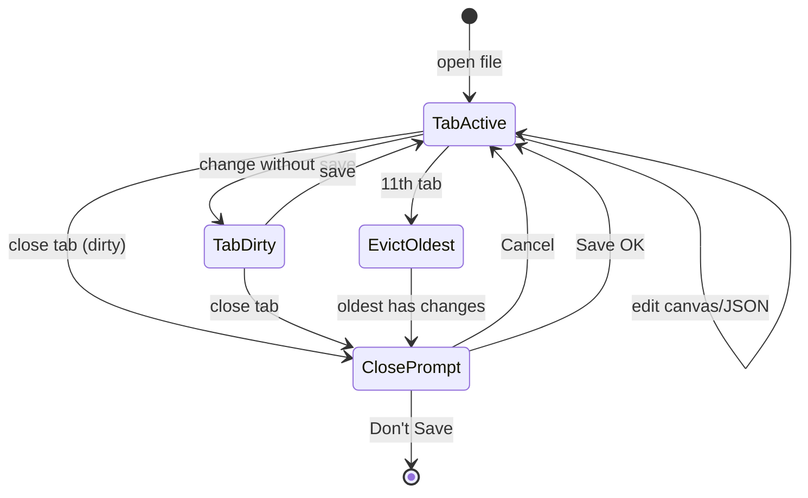
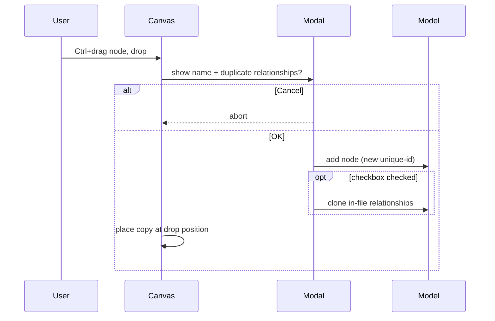
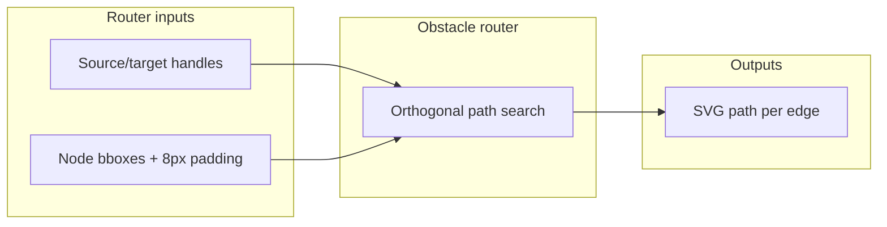
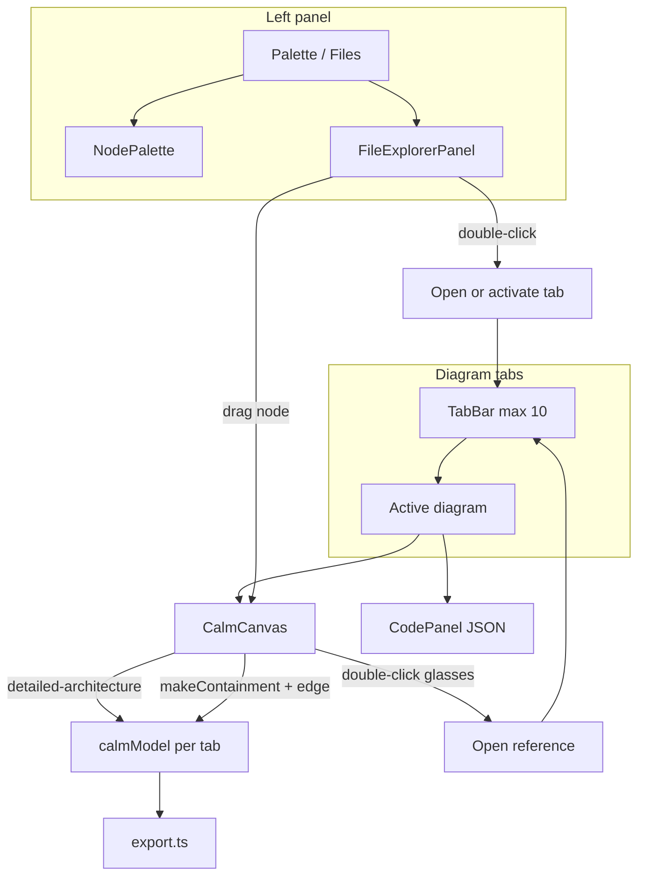

# CALM Studio — Modeling Extensions and Editor Fixes — PRD


|                        |                                                                                                  |
| ---------------------- | ------------------------------------------------------------------------------------------------ |
| **Owner / DRI**        | TBD                                                                                              |
| **Status**             | Draft                                                                                            |
| **Version**            | 0.17                                                                                             |
| **Last updated**       | 2026-07-21                                                                                       |
| **Target release**     | TBD                                                                                              |
| **Reviewers**          | eng lead, design                                                                                 |
| **Supported browsers** | **Chrome**, **Safari** (current + previous major versions)                                       |
| **Links**              | [BBR.MD](./BBR.MD) · [AGENTS.md](../AGENTS.md) · [CALM 1.2](https://calm.finos.org/release/1.2/) · [IDEA V4](./ideas/IDEA-calmrj-project-and-extract.md) |


> **TL;DR** — We will extend CALM Studio with a folder browser panel for CALM files and drag-and-drop references via `detailed-architecture`, **multiple diagrams in tabs** with a JSON editor bound to the active tab, and **visual navigation to referenced diagrams** (glasses icon). We will add **structured** `metadata` **editing** in the properties panel, including field scaffolding per extension schema, and a **read-only mode** for reference nodes with `details.detailed-architecture`. **V3** polishes the file panel (reveal active file, refresh node list on save), adds **Ctrl+drag node duplication** with an optional relationship copy dialog, **focuses the referenced node** after drill-down navigation, and delivers **full diagram layout** — no overlapping boxes plus **obstacle-aware edge routing** on auto-layout, manual placement, and label resize (#16 in R23). **V4** adds a **project file** (`*.calmrj`) for Spectral ruleset selection, directory/naming conventions, and **extract node → separate diagram** (parent becomes a `detailed-architecture` stub). We will fix critical JSON editor, export, and container sizing bugs. Earlier iterations add automatic `$schema` in the JSON header (CALM 1.2 + extension pack), required fields when creating elements, and direction reversal for all relationship types.


## Contents

- [1. Problem and context](#1-problem-and-context)
- [2. Goals, non-goals, and success metrics](#2-goals-non-goals-and-success-metrics)
- [3. Target users and use cases](#3-target-users-and-use-cases)
- [4. Proposed solution](#4-proposed-solution)
- [5. Requirements](#5-requirements)
- [6. UX and design](#6-ux-and-design)
- [7. Technical aspects](#7-technical-aspects)
- [8. Release criteria and rollout](#8-release-criteria-and-rollout)
- [9. Open questions and risks](#9-open-questions-and-risks)
- [10. Appendix and change log](#10-appendix-and-change-log)


## 1. Problem and context

CALM Studio today lets users model architecture in a single file with a palette of node types, but it lacks multi-file project workflows and cross-document node referencing. **The editor supports only one open diagram at a time** — switching between files replaces the window content instead of working in tabs, which complicates navigation in multi-file projects and tracking references. Nodes with `details.detailed-architecture` lack a clear visual indicator and quick navigation to the target diagram. **In V3**, even with the Files panel and tabs, users still lose orientation in large trees (no reveal for the active file), see stale node previews after save, cannot duplicate in-diagram nodes with optional relationship copy, land on a detail diagram without the referenced node in view, and suffer overlapping boxes or edges drawn through nodes after label resize or auto-layout. **In V4**, there is still no project-level config: teams cannot attach folder-scoped Spectral rules on top of core CALM validation, nor encode directory/naming conventions for new diagram files. Splitting a growing node into its own diagram requires manual file creation, path math, and stub wiring. At the same time, the editor suffers from regressions in the JSON panel (repeated selection, jumping cursor), export omits relationships when nodes are visually nested in containers, and when the type changes to a container the element size no longer matches its visualization.

**Why now:** Users work with real CALM projects (multiple JSON files, cross-file references, enterprise naming like CEngineering), but must switch manually outside the studio and maintain project conventions by hand. Editor and export bugs undermine trust in the tool as the source of truth for CALM 1.2 documents.

**Current state (from code analysis):**


| Area                         | State                                                                                                     |
| ---------------------------- | --------------------------------------------------------------------------------------------------------- |
| `$schema` in JSON header     | Missing — model store holds only `{ nodes, relationships }`                                               |
| Required fields on create    | Partial — e.g. missing `description` on new nodes; missing `metadata` scaffold per extension schema       |
| `metadata` editing in UI     | Missing — properties panel has only `customMetadata` (free keys), not CALM `metadata` or extension fields |
| Reference node — properties  | Missing — nodes with `details.detailed-architecture` can still be edited (should be read-only)            |
| Relationship direction swap  | Missing — source/destination are read-only in `EdgeProperties`                                            |
| Folder panel                 | Missing — left panel is only `NodePalette`                                                                |
| Multiple diagrams (tabs)     | Missing — one active document, switching = content replacement                                            |
| Reference navigation         | Missing — references without glasses icon and without opening the target                                  |
| JSON re-selection            | Bug — `$effect` in `CodePanel` depends on `value`                                                         |
| Cursor at start              | Bug — full `calmJson` replacement on sync                                                                 |
| Export without relationships | **Fixed** — merge canvas + model; SVG/PNG with inline stroke on edges (see §7.1)                          |
| Container size               | Bug — promoted node lacks container dimensions                                                            |
| Reveal file in tree          | Missing — no button to locate active tab's file in Files panel                                            |
| Node list refresh on save    | Missing — `handleSave` does not re-parse nodes for explorer tree                                          |
| Ctrl+drag duplicate          | Missing — only clipboard paste; no modal, no relationship copy                                            |
| Focus after reference nav    | Missing — `handleNavigateReference` opens tab but does not select target node                             |
| Layout overlap / edges       | Partial — text-based box sizing exists; ELK uses fixed dims; edges do not avoid boxes                     |
| Project file (`.calmrj`)     | Missing — no project config, ruleset selection, or naming conventions                                 |
| Folder Spectral rules        | Missing — only built-in / core validation                                                             |
| Extract node → diagram       | Missing — manual file create + stub wiring                                                            |


## 2. Goals, non-goals, and success metrics

**Goals**

- Enable browsing a project folder and quickly switching between CALM files in the browser.
- Support **working with multiple diagrams in tabs simultaneously** (max. 10), including safe closing with a save prompt.
- Support adding references to nodes from other files via standard CALM `detailed-architecture` and **quick navigation to the referenced diagram**.
- Remove blocking JSON editor, export, and container bugs.
- **V3:** Speed up orientation in large projects (reveal file, fresh node list), support safe in-file node duplication, and make reference drill-down and auto-layout trustworthy on real diagrams.
- **V4:** Persist project config in `*.calmrj` (Spectral rulesets, directory/naming conventions); **extract** a node into its own diagram file with a confirm dialog and parent stub reference.

**Non-goals**

- Desktop (Tauri) folder panel version — deferred; first iteration web only (File System Access API).
- Full extension pack management in UI (install, marketplace).
- ArchiMate / C4 specific workflows beyond the existing mode.
- Automatic file sync on disk when changes occur in another window (watch mode).
- File tree virtualization for folders with 100+ JSON files — risk accepted in v1.
- **Split view** (two diagrams side by side) — deferred; v1 uses tabs only.
- **Duplicate tabs for the same file** — one file = one tab; reopening only switches to the active tab.
- **Global undo/redo across tabs** — deferred; undo/redo applies **only within the active tab** (see #11).
- **Generic metadata editor for arbitrary JSON Schema** without bundled pack schema in the repository — v1 only packs with `schemaUrl` / bundled schema (ArchiMate first).
- **Opening links outside the project in the editor** — deferred; infobox + external browser tab only (see #10).
- **Authoring Spectral rules in the UI** — V4 selects/enables existing ruleset files; rule authoring stays in external editors.
- **Per-rule toggle inside a ruleset** — V4 enables/disables whole ruleset paths only (#19).
- **Hard-coded CEngineering layout only** — naming is configurable; CEngineering is a bundled default profile, not the sole structure (#20).

**Success metrics**


| Metric                                         | Baseline                | Target                                              | Due  |
| ---------------------------------------------- | ----------------------- | --------------------------------------------------- | ---- |
| Switch between CALM files in folder            | Manual open dialog      | ≤ 2 clicks (double-click in tree)                   | v1   |
| JSON export contains all diagram relationships | Broken when nested      | 100% of canvas relationships in export              | v1   |
| JSON editing without unwanted selection        | Selection on every sync | 0 unwanted full-select during editing               | v1   |
| Cursor during JSON editing                     | Jumps to start          | Cursor stays in place while typing                  | v1   |
| Cross-file reference                           | Not supported           | Drag node → `detailed-architecture` ref in model    | v1   |
| Diagrams open simultaneously                   | 1                       | Up to 10 tabs, switching ≤ 1 click                  | v1.1 |
| Open referenced diagram from canvas            | Not available           | Double-click glasses → activate existing tab        | v1.1 |
| Metadata editing in properties panel           | customMetadata only     | Schema-driven form for extension packs              | v1.1 |
| Accidental reference node edit in properties   | Possible                | 0 mutations via properties UI for references        | v1.1 |
| Duplicate tab for same file                    | —                       | 0 duplicates — always switch to existing tab        | v1.1 |
| Locate active file in Files tree               | Manual scroll/search    | ≤ 2 clicks (reveal button)                          | v3   |
| Node list matches saved file                   | Stale until re-expand   | 100% refresh within 1 s after save                  | v3   |
| In-file node duplicate (Ctrl+drag)             | Clipboard only          | Modal flow ≤ 3 actions; new `unique-id`             | v3   |
| Referenced node visible after drill-down       | Tab opens, no focus     | Target node selected + in viewport within 1 s       | v3   |
| Overlapping boxes after text resize            | Overlap on long labels  | 0 overlaps on reference test diagrams after layout  | v3   |
| Edges through node interiors (manual layout)   | Common on drag/resize   | 0 interior intersections when alternate path exists | v3   |
| Load / create project config on Open folder    | Not available           | Auto-load `*.calmrj` or Create wizard ≤ 2 clicks    | v4   |
| Extra Spectral rulesets applied with core CALM | Core only               | Enabled rulesets from `.calmrj` run on validate     | v4   |
| Extract node to new diagram file               | Manual                  | Dialog + stub + child file ≤ 4 actions              | v4   |


## 3. Target users and use cases

**Primary persona:** Architect / developer modeling CALM 1.2 architecture in the browser, working with a repository of multiple JSON files.

**Key use cases**

1. **UC-1 — Browse project:** User selects the project root folder and sees a tree of JSON files in the left panel.
2. **UC-2 — Open file:** Double-click on a CALM file opens the diagram in a tab (or activates an already open tab). Closing a tab with unsaved changes prompts to save (R15).
3. **UC-3 — Preview nodes in file:** Under a CALM file in the tree, nodes are visible (`name` + icon by `node-type`).
4. **UC-4 — Cross-file reference:** User drags a node from another file onto the canvas → a reference is created via `detailed-architecture`.
5. **UC-5 — Reliable JSON editing:** Editing in the Code panel without cursor jumping and repeated full-element selection.
6. **UC-6 — Correct export:** JSON/SVG/PNG export contains relationships matching the diagram.
7. **UC-7 — Multiple diagrams in tabs:** User opens several CALM files; each **unique** file has at most one tab. Reopening the same file only **switches to the existing tab** (no duplicate). The active tab determines canvas, properties, and JSON panel.
8. **UC-8 — Navigate to reference:** User double-clicks the glasses icon to open the target diagram in the editor if it lies within the selected project folder; otherwise an infobox "Link leads outside project" with a link opening in a new browser tab.
9. **UC-9 — Metadata in properties:** User edits structured node `metadata` in the properties panel (e.g. ArchiMate `owner`, `archimate.layer`, `lifecycle`) per the active pack's extension schema.
10. **UC-10 — Read-only reference:** User selects a reference node (`details.detailed-architecture`) — properties panel shows values read-only; edits are made in the target diagram or via glasses navigation.
11. **UC-11 — Reveal active file:** User works in a tab with a project file; clicks **Reveal in tree** → if Palette is active, panel switches to Files → tree expands ancestors, scrolls to file, highlights it.
12. **UC-12 — Fresh node preview after save:** User adds/renames nodes, saves → expanded file entry in Files panel shows updated node list without manual collapse/expand.
13. **UC-13 — Duplicate node in diagram:** User holds **Ctrl**, drags an existing node, drops → modal asks for name and optional relationship copy → new node appears at drop position with new `unique-id`.
14. **UC-14 — Drill-down with context:** User double-clicks glasses on reference → target diagram opens → the **source** node (matching reference `unique-id`) is selected and brought into view.
15. **UC-15 — Readable layout:** User runs auto-layout or edits long labels → boxes do not overlap; relationship lines route around **all** node bounds (including manually placed nodes after resize), never through box interiors.
16. **UC-16 — Project config:** User opens a folder; Studio loads `*.calmrj` (or offers Create). User enables Spectral ruleset paths and naming profile; settings persist in the project file.
17. **UC-17 — Extract to diagram:** User selects a node → **Extract to diagram** → confirms folder/filename (defaults from naming config) → child file is written; parent node becomes a reference stub; child opens in a tab.

**Not for:** Users outside officially supported browsers (**Chrome**, **Safari**). Firefox, Edge, and older versions without File System Access API — file panel unavailable, rest of studio may work with limitations.

## 4. Proposed solution


### 4.1 Left panel — Palette / Files toggle

Replace the permanent `NodePalette` with a two-mode toggle in the same left column:

- **Palette** — existing behavior (node types from packs).
- **Files** — folder tree with JSON files; for CALM files, expandable node list.

Folder selection via File System Access API (`showDirectoryPicker`). Recursive load of `.json` files with lazy parsing for node lists.

### 4.2 Cross-file reference

When dropping a node from the file panel onto the canvas, a new node is added to the current diagram that:

1. Copies display from the source node (`name`, `node-type`, `description`).
2. Sets `details.detailed-architecture` to a **relative path** from the file currently open in the editor to the source `.json` file.

The shape is verified against `[calm/release/1.2/meta/core.json](../../../calm/release/1.2/meta/core.json)`: `detailed-architecture` is a **string** (URL or file path), not an object. The property belongs under `node.details`, not at the node root.

```json
{
  "unique-id": "ref-api-gateway",
  "node-type": "system",
  "name": "API Gateway",
  "description": "Reference to external architecture",
  "details": {
    "detailed-architecture": "architectures/api-gateway.json"
  }
}
```

The relative path is computed against the location of the currently edited file within the selected project folder (e.g. `../data/api-gateway.json`).

### 4.3 Bug fixes (P0)

- **JSON re-selection:** Run selection effect only on `selectedNodeId` / `selectedEdgeId` change, not on every `value` change.
- **Cursor:** Separate local CodeMirror state from model sync — do not overwrite the entire document when the editor has focus; patch/diff or suppress external updates.
- **Export relationships:** Merge canvas state with loaded model on persist/export; preserve `relationships` from model if canvas edges are not yet linked; infer `composed-of` from `parentId`; add inline `stroke` to edge paths in SVG/PNG (see §7.1).
- **Container:** When promoting to container, set default dimensions (300×200, consistent with palette).


### 4.4 Tabbed diagram editor (P1)

Newly opened diagrams (from file panel, toolbar Open, drag-drop, reference navigation) open in **tabs** below the toolbar:

- Each tab = one diagram (own model, canvas state, dirty flag, file handle / relative path).
- **No duplicates:** the same file (`relativePath` or `fileHandle`) may have **only one tab** in TabBar. Reopening (double-click in tree, Open, drop, glasses, recent files) **does not create a new tab** — only activates the existing one.
- **Active tab** drives canvas, properties panel, and **JSON editor** — Code panel always shows JSON for the active diagram.
- **Close tab** (× on tab): if the diagram has unsaved changes, show **Save / Don't Save / Cancel** dialog (same pattern as when switching files).
- **Limit of 10 tabs:** when opening an 11th **new** diagram, automatically close the **oldest open** tab (**FIFO** by `openedAt` — open order, not last access); closing it uses the same unsaved guard as manual close.
- Tab switch **does not require** a dialog (context change only); dirty state remains per tab.
- **Undo/redo** (Ctrl+Z / Ctrl+Y): applies **only to the active tab** — each tab has its own history stack; switching tabs restores its undo/redo context.
- Tab label = file name; unsaved diagram shows `•` (dirty) indicator.




### 4.5 Reference — glasses icon and navigation (P1)

Nodes with `details.detailed-architecture` (reference elements from R4 or manually set) show a **glasses icon** on the canvas to highlight that they link to another diagram:

- Icon is part of the node component (does not cover the whole node), with tooltip e.g. "Open referenced diagram".
- **Double-click on glasses icon** (not the whole node) attempts to open the target diagram:
  - Path from `detailed-architecture` is resolved against the current file / project root folder (folder selected in file panel).
  - **Target inside project:** open in editor tab (new, or switch to existing — no duplicate).
  - **Target outside project** (relative path leads outside root, absolute path, `http(s)://` URL, or file unavailable via FS API): **do not open in editor**. Instead show an **infobox** with text **"Link leads outside project"** and a clickable link to the original `detailed-architecture` value. Click opens target in a **new browser tab** (`target="_blank"`, `rel="noopener noreferrer"`) — outside CalmStudio editor.
- If target inside project physically does not exist (file deleted), show error in editor (toast / banner), canvas unchanged.


### 4.6 Model extensions (P1 — schema and properties)

- On first element from palette, write CALM 1.2 `$schema` and extension URL to JSON header from central `schemaUrl` in the respective pack's `PackDefinition`.
- When creating node/relation, fill required fields per schema (core + extension).
- In properties panel, button to reverse direction for all relationship variants.


### 4.7 Metadata in properties and read-only reference (P1)

`metadata` **editing (BBR line 13)**

A CALM node/relationship may carry a `metadata` object (distinct from `customMetadata`). For extension packs (e.g. ArchiMate) the schema defines required and optional fields — see `[calm-archimate-extension.schema.json](../packages/calm-core/src/schemas/calm-archimate-extension.schema.json)`.

Properties panel adds a **Metadata** section with a form driven by the active pack's schema:

- Load extension pack JSON Schema (`PackDefinition.schemaUrl` or bundled schema in `calm-core`).
- Show fields per `required` / `properties` (enum select, string input, nested objects e.g. `metadata.archimate`).
- Validate input against schema before writing to model (same rules as CALM validator).

**Scaffold on element create**

On drop / place from palette or relation create, the new element gets **all required metadata fields** with default values per schema and `node-type` **mapping** (decision #14):

- ArchiMate node: `metadata.owner` (placeholder, e.g. `"TBD"`), `metadata.archimate.element` = `node-type`, `metadata.archimate.layer` and `metadata.archimate.viewpoint` from lookup table in pack (`archimate.ts` / `archimateMetadataDefaults`).
- Fields without explicit mapping: first valid value from schema `enum`; if none — validator warns after create.

**Default** `node-type` **→** `layer` **/** `viewpoint` **mapping (ArchiMate)**


| Prefix / `node-type`                                                                                                                                                | `layer`     | `viewpoint`                                                                    |
| ------------------------------------------------------------------------------------------------------------------------------------------------------------------- | ----------- | ------------------------------------------------------------------------------ |
| `archimate:business*`                                                                                                                                               | Business    | `SystemContext`                                                                |
| `archimate:application*`, `archimate:dataObject`, `archimate:dataStore`                                                                                             | Application | `ApplicationCooperation` (`dataObject` / `dataStore` → `InformationStructure`) |
| `archimate:node`, `archimate:device`, `archimate:systemSoftware`, `archimate:technology*`, `archimate:artifact`, `archimate:path`, `archimate:communicationNetwork` | Technology  | `TechnologyDeployment`                                                         |


Lookup is part of ArchiMate pack definition — single source of truth for palette, scaffold, and validation.

Scaffold also applies to **R11** (required core fields) — `metadata` is a separate branch beyond `unique-id`, `name`, `description`.

**Read-only properties for references (BBR line 14)**

Nodes with non-empty `details.detailed-architecture` are **reference proxies** — canonical data lives in the target file.

- Properties panel for such a node: **fully read-only** — no editable fields (decision #13).
- Show banner: "Reference node — edit the source diagram" + action "Open source" (glasses / R16).
- Also show `details.detailed-architecture` (read-only); changing the link target **is not** in properties — user edits JSON directly or deletes reference and creates a new one.
- JSON editor: editing reference node remains possible (power user) — properties UI intentionally blocks all proxy node mutations.


### 4.8 Reveal active file in Files tree (P1 — BBR V3)

In the **Files** panel header (next to **Open folder**), add a **Reveal in tree** button (icon: crosshair / target / locate):

- Enabled when a project folder is open **and** the active tab has a `relativePath` within that folder.
- **Decision #18 (confirmed):** If the left panel is on **Palette**, **auto-switch to Files** before reveal — button is always reachable from toolbar/context without requiring the user to find the Files tab first.
- On click: expand all ancestor directories, expand the file row if collapsed, scroll the file row into view (`scrollIntoView`), apply a temporary highlight (same `.current` style or pulse).
- If the file is not in the current tree (e.g. Save As outside project, untitled tab), show a short toast: *"Current file is not in the open project folder."*
- Does **not** change the active tab or open files — navigation only within the tree.


### 4.9 Refresh node list on save (P1 — BBR V3)

After a **successful** save of a file that has a `relativePath` in the open project:

1. Re-parse the saved JSON (`loadCalmNodesForFile`).
2. Update the in-memory explorer tree (`updateFileInTree` + `setExplorerTree`).
3. If the file row was expanded in the UI, keep it expanded and refresh the child node list in place.

Applies to **Save** and **Save As** when the resulting file path lies under the project root. No full tree rescan — only the saved file entry is updated.

### 4.10 Ctrl+drag node duplication (P1 — BBR V3)

When the user **holds Ctrl** (or Cmd on macOS) while dragging an **existing canvas node** and drops it on the canvas or **inside a container**:

1. **Do not move** the original node — create a **copy** at the drop position.
2. **Decision #17 (confirmed):** If dropped **inside a container**, after the modal confirms, apply the same containment rules as a normal drop (`parentId` + `composed-of` / `deployed-in` edge) to the **new** copy only — the original node stays in place.
3. Show a **modal dialog** before the copy is finalized:
  - **Name** field (required), pre-filled with `{original name} (copy)`.
  - **Checkbox:** *"Duplicate relationships"* — default **unchecked**.
  - Checkbox state is **persisted** in `sessionStorage` (key e.g. `calm-studio.duplicateRelationships`) and restored on next open.
  - Buttons: **OK** / **Cancel** — Cancel aborts; original node unchanged.
4. New node gets a **new** `unique-id` (`nanoid`); copies `node-type`, `description`, `metadata`, `details` from source (except `unique-id` and user-edited `name`).
5. **Relationship duplication** (only when checkbox checked):
  - Duplicate only `relationships` records **in the current file** where the original node's `unique-id` appears as source, target, actor, container, or child.
  - Rewire duplicated relationships to the **new** `unique-id` where the old id appeared.
  - **Do not** duplicate the nodes on the other end of relationships.
  - **Do not** follow or duplicate cross-file references (`details.detailed-architecture`) beyond copying the field on the node itself.
  - **Do not** recursively duplicate connected subgraphs.
6. Visual feedback during drag: cursor/copy badge when Ctrl is held (distinct from normal move).
7. **Out of scope:** duplicating reference-proxy nodes dragged from Files panel (existing R4 behavior unchanged).




### 4.11 Focus referenced node after drill-down (P1 — BBR V3)

Extend `handleNavigateReference` (glasses navigation, R16):

1. Before navigation, capture the reference node's `unique-id` (`calmId` on canvas / model).
2. Open or activate the target diagram tab (existing behavior).
3. After the target model and canvas load, **select** the node whose `unique-id` matches the captured id.
4. **Bring into view:** center or `fitView` on that node (padding ~40 px); do not reset zoom below user's current min zoom if tab was already open.
5. If the id is **missing** in the target file (stale reference): show non-blocking warning toast; tab still opens; no selection.
6. Properties panel and JSON editor sync to the focused node when found.


### 4.12 Layout — no overlap, edges avoid boxes (P1 — BBR V3, R23)

Improve diagram readability when labels grow, after auto-layout, and when nodes are **manually placed or resized** without re-running layout.

**Node sizing**

- Before ELK layout, pass **measured** width/height from canvas (`estimateRectangleNodeSize` / actual node dimensions) into `elkLayout.ts` instead of fixed 180×70 defaults where available.
- After layout apply, re-run a **collision pass** or increase `elk.spacing.nodeNode` / `elk.layered.spacing` until no two sibling nodes' bounding boxes intersect on reference test diagrams.
- When a label resize widens/tallens a node on canvas, update that node's stored dimensions and treat the new bbox as an obstacle for edge routing (see below).

**Edge routing — full obstacle avoidance (#16 confirmed, in scope for R23)**

Relationship edges must **not** draw through node bounding boxes when an alternate path exists. This applies to **all** rendering modes:


| Mode                   | Requirement                                                                             |
| ---------------------- | --------------------------------------------------------------------------------------- |
| After **auto-layout**  | Use ELK edge sections / bend points where available; otherwise obstacle router          |
| **Manual placement**   | Pinned or free-dragged nodes — edges re-route around obstacles without requiring layout |
| **After label resize** | Recompute affected edge paths when node dimensions change                               |


**Obstacle model**

- Obstacle = axis-aligned bounding box of every **visible** node on the active canvas (including containers and nested children in world coordinates).
- Add a **padding margin** (default 8 px) around each obstacle so edges do not graze labels.
- Source and target nodes of an edge are excluded from obstacles for that edge (only intermediate nodes block the path).

**Routing algorithm (engineering choice, acceptance-tested)**

- Replace naive `getSmoothStepPath` with an **obstacle-aware orthogonal router** shared by all edge components (`ConnectsEdge`, `InteractsEdge`, `ComposedOfEdge`, `DeployedInEdge`, `OptionsEdge`).
- Router input: source/target handle positions + list of obstacle rects.
- Router output: SVG path with orthogonal segments and bend points that **do not intersect** obstacle interiors.
- Re-run routing when: edge added/removed, node moved, node resized, container child layout changes, zoom/pan does **not** require re-route (world-space obstacles).
- **Best-effort fallback:** if no zero-intersection path exists in reasonable search bounds, minimize intersection count and prefer routing along canvas periphery; never silently revert to a path through the source/target node itself.

**Triggers**

- Auto-layout button (existing) — positions + ELK edge routes where available.
- **Live:** node drag end, property edit that changes `name`/dimensions, paste/duplicate — obstacle router runs for affected edges.
- Optional toast when label resize causes node overlap with a sibling: *"Run layout to fix overlaps"* — overlap fix remains manual; edge routing still updates.




### 4.13 Project file `*.calmrj` (P1 — BBR V4)

When the user opens a project folder (R1), Studio looks for **exactly one** `*.calmrj` file in the **folder root** (case-insensitive match on extension).

| Situation | Behavior |
| --- | --- |
| One `*.calmrj` found | Load as active project config |
| None found | Offer **Create project** wizard (defaults from bundled profile); user may skip and work without project features until created |
| Multiple `*.calmrj` | Error toast; ask user to keep one file in root |

**Format:** JSON. **Filename:** any (e.g. `onebank.calmrj`, `project.calmrj`). The file is the home for:

1. Enabled **Spectral** ruleset paths (relative to project root).
2. **Directory structure + naming conventions** used by Extract (R27).
3. Future diagram-related settings (placeholder object allowed; unused keys ignored with forward compatibility).

```json
{
  "$schema": "https://calmstudio.local/schemas/calmrj-1.0.json",
  "version": 1,
  "name": "onebank",
  "validation": {
    "rulesets": [
      { "path": "validation/team-rules.yaml", "enabled": true },
      { "path": "validation/pci.yaml", "enabled": false }
    ]
  },
  "naming": {
    "profile": "cengineering-archimate",
    "rootDirs": {
      "application-component": "application-components"
    },
    "patterns": {
      "archimate:applicationComponent": {
        "dir": "appcomp.{{name}}",
        "file": "{{name}}.appcomp.json"
      },
      "archimate:applicationService": {
        "dir": "appserv.{{name}}",
        "file": "{{name}}.appserv.json"
      },
      "archimate:applicationInterface": {
        "dir": "ep.{{name}}",
        "file": "{{name}}.ep.json"
      }
    }
  },
  "diagrams": {}
}
```

- **Core CALM schema validation is always on** — project rulesets **supplement**, never replace it (#19).
- UI: Project settings panel (or Files header menu) to toggle `enabled` per ruleset path and pick/edit naming profile.
- Selecting a ruleset records the choice in `.calmrj` (write via FS API when user saves project settings or on Create).

**Bundled default profile** `cengineering-archimate` uses stereotype + slugified **element name** (`appserv.test-service`, `ep.get-users`, `appcomp.bem`). Extract places **one subfolder** under the **current diagram’s directory** (not from project root via unique-id). Patterns remain **editable** in `.calmrj` (#20).


### 4.14 Folder Spectral validation (P1 — BBR V4)

- Ruleset files live in the project (typical path `validation/*.yaml` or `*.json`); `.calmrj` only stores relative paths + `enabled`.
- On validate (toolbar / save / Problems panel): run core CALM validation, then each **enabled** Spectral ruleset against the active document (and optionally all open tabs — engineering choice; acceptance: at least active document).
- Missing ruleset file → non-blocking warning, other rules still run.
- **Out of scope:** in-app Spectral rule authoring; per-rule toggles inside a ruleset.


### 4.15 Naming conventions for new paths (P1 — BBR V4)

Used primarily by **Extract to diagram** (and future “New diagram from type” flows):

1. Resolve `node-type` against `naming.patterns` in `.calmrj`. Template token `{{name}}` is the slugified node **display name** (not `unique-id`).
2. Default folder = `dirname(current diagram)` + **one** subfolder from `dir` (e.g. `…/bem/` + `appserv.test-service`).
3. If profile is `cengineering-archimate` and pattern missing, fall back to bundled defaults for known ArchiMate stereotypes.
4. If still unmapped: open Extract dialog with **empty** relative folder/file fields and a warning — user must fill paths manually; Extract is not blocked (#20).
5. Dialog always lets the user **confirm or edit** folder and filename; config values are **defaults only**.


### 4.16 Extract node to separate diagram (P1 — BBR V4, #21)

**Command:** context menu / properties action **Extract to diagram** on a selected canvas node (not on reference stubs that already have `detailed-architecture`).

**Dialog (modal):**

```
┌─ Extract to diagram ──────────────────────────┐
│ Folder: […/bem/appserv.test-service________]  │  ← under current diagram
│ File:   [test-service.appserv.json_________]  │  ← from element name
│                                               │
│ ⚠ No naming pattern for this node-type       │  ← only if unmapped
│                                               │
│              [Cancel]  [Extract]              │
└───────────────────────────────────────────────┘
```

**On Extract (atomic, best-effort with rollback on write failure):**

1. **Child architecture** = selected node + **containment descendants** (via `composed-of` / `deployed-in` / canvas `parentId`) + relationships whose **all** endpoints lie inside that node set.
2. Write child CALM JSON to `folder/file` under project root (create intermediate directories). Path relative to project; overwrite requires confirm if file exists.
3. In **parent** diagram: remove extracted nodes and internal relationships from the model; replace the selected node with a **stub** that keeps the **same** `unique-id`, display fields (`name`, `node-type`, `description`), and sets `details.detailed-architecture` to the **relative path** from the parent file to the new child (R4 / CALM 1.2 string).
4. **External relationships** (one endpoint outside the extract set) **remain on the stub** in the parent — do not move to the child.
5. Mark parent dirty; write child file; refresh Files tree for new path (R20-style); **open child in a new tab** (or activate if somehow already open).
6. Stub shows glasses icon (R16); properties read-only (R18).

```mermaid
sequenceDiagram
  participant User
  participant Dialog
  participant Parent
  participant FS
  participant Tabs

  User->>Dialog: Extract to diagram
  Dialog-->>User: folder/file defaults from .calmrj
  User->>Dialog: confirm / edit, Extract
  Dialog->>FS: write child architecture
  Dialog->>Parent: stub + detailed-architecture; drop extracted subgraph
  Dialog->>Tabs: open child tab
```

**Allowed types:** all node types. Reference proxies (already have `detailed-architecture`) — Extract **disabled**.


```json
{
  "unique-id": "ref-api-gateway",
  "node-type": "archimate:applicationComponent",
  "name": "API Gateway",
  "description": "Reference to external architecture",
  "details": {
    "detailed-architecture": "architectures/api-gateway.json"
  },
  "metadata": {
    "owner": "platform-team",
    "archimate": {
      "layer": "Application",
      "element": "archimate:applicationComponent",
      "viewpoint": "ApplicationCooperation"
    }
  }
}
```




## 5. Requirements


### Iteration 1 — P0


| ID  | User story                                                                               | Priority | Acceptance criteria                                                                                                                                                                                                                                                                                                                                                                                                                       | Status |
| --- | ---------------------------------------------------------------------------------------- | -------- | ----------------------------------------------------------------------------------------------------------------------------------------------------------------------------------------------------------------------------------------------------------------------------------------------------------------------------------------------------------------------------------------------------------------------------------------- | ------ |
| R1  | As an architect I want to select a project folder so I can see all CALM files in a tree. | P0       | - [ ] "Open folder" button in file panel - [ ] Uses `showDirectoryPicker` (web) - [ ] Tree shows folders and `.json` files hierarchically - [ ] Graceful error if API unavailable (recommend Chrome/Safari) - [ ] After page refresh restore folder access without new selection (persist `FileSystemDirectoryHandle`) - [ ] Works in **Chrome** and **Safari**                                                                           | Open   |
| R2  | As an architect I want to double-click to open a CALM file from the panel.               | P0       | - [ ] Double-click on `.json` opens new tab, or **switches to existing** for same file (no duplicate) - [ ] After open/activate, canvas and JSON panel of active tab update                                                                                                                                                                                                                                                               | Open   |
| R3  | As an architect I want to see nodes under a CALM file.                                   | P0       | - [ ] Expanding file shows `nodes[]` - [ ] Label = `name` attribute - [ ] Icon by `node-type` (same resolver as palette) - [ ] Non-CALM JSON files without sub-nodes (file only)                                                                                                                                                                                                                                                          | Open   |
| R4  | As an architect I want to drag a node from another file onto the diagram as a reference. | P0       | - [ ] Drag from file panel to canvas creates new node - [ ] `unique-id` = node ID in source file - [ ] `details.detailed-architecture` = relative path to source file - [ ] Shape matches CALM 1.2 (`string` under `details`) - [ ] Copied `name`, `node-type`, `description` from source - [ ] Reference visually distinct on canvas - [ ] **Forbidden** drag node from same file as currently open (no drop, disabled visual indicator) | Open   |
| R5  | As a user I want to switch between type palette and file panel.                          | P0       | - [ ] Palette / Files toggle in left panel - [ ] Existing palette behavior unchanged - [ ] Remember last mode in session                                                                                                                                                                                                                                                                                                                  | Open   |
| R6  | As a user I want to edit JSON without repeated full-element selection.                   | P0       | - [ ] When editing JSON with selected node, full block is not re-selected repeatedly - [ ] Scroll/highlight to selected node only on selection change                                                                                                                                                                                                                                                                                     | Open   |
| R7  | As a user I want to edit JSON without cursor jumping to start.                           | P0       | - [ ] When typing in Code panel cursor stays in place - [ ] Applies even when no element selected on canvas                                                                                                                                                                                                                                                                                                                               | Open   |
| R8  | As a user I want to export diagram including all relationships.                          | P0       | - [x] JSON export contains `relationships` matching canvas - [x] Nesting in container creates `composed-of` relationship - [x] SVG/PNG export shows edges (inline stroke, works with `file://`) - [x] Empty canvas with loaded model does not export empty JSON                                                                                                                                                                           | Done   |
| R9  | As a user I want container to have correct size after type change.                       | P0       | - [ ] After change/promotion to container dimensions ≥ 300×200 (or fit children) - [ ] Nested nodes visually inside container                                                                                                                                                                                                                                                                                                             | Open   |


### Iteration 2 — P1 (tabs, references, schema)


| ID  | User story                                                                                            | Priority | Acceptance criteria                                                                                                                                                                                                                                                                                                                                                                                                                                                                                                                                                                                                     | Status |
| --- | ----------------------------------------------------------------------------------------------------- | -------- | ----------------------------------------------------------------------------------------------------------------------------------------------------------------------------------------------------------------------------------------------------------------------------------------------------------------------------------------------------------------------------------------------------------------------------------------------------------------------------------------------------------------------------------------------------------------------------------------------------------------------- | ------ |
| R15 | As an architect I want to open diagrams in tabs so I can work with multiple files at once.            | P1       | - [ ] New **not yet open** diagram opens in tab (file panel, Open, drop, demo, reference navigation) - [ ] **Same file again:** no new tab — only activate existing (match `relativePath` or `fileHandle`) - [ ] Active tab drives canvas, properties, and JSON editor - [ ] Tab switch without dialog; dirty state per tab - [ ] **Undo/redo only within active tab** (per-tab history stack) - [ ] Close tab: Save / Don't Save / Cancel dialog on unsaved changes - [ ] Max. **10** tabs; on 11th new file evict **FIFO** (oldest `openedAt`, not LRU) + unsaved guard - [ ] Label = file name + dirty indicator `•` | Open   |
| R16 | As an architect I want to see glasses on reference node and open target diagram.                      | P1       | - [ ] Node with `details.detailed-architecture` shows glasses icon on canvas - [ ] Tooltip explains it is a reference - [ ] Double-click on glasses (not whole node) - [ ] Target **inside project:** editor tab (new or existing, no duplicate) - [ ] Target **outside project:** infobox "Link leads outside project" + clickable link; click → new **browser** tab (not editor) - [ ] Resolve relative path against current file / project root - [ ] Error when file missing inside project without editor crash                                                                                                    | Open   |
| R10 | As an architect I want `$schema` written to JSON on first element.                                    | P1       | - [ ] First node from palette adds document header - [ ] Base: `https://calm.finos.org/release/1.2/meta/calm.json` - [ ] Extension URL from `schemaUrl` in that pack's `PackDefinition` - [ ] Round-trip: import → edit → export preserves header                                                                                                                                                                                                                                                                                                                                                                       | Open   |
| R11 | As an architect I want new elements to have required fields per schema.                               | P1       | - [ ] New node: `unique-id`, `node-type`, `name`, `description` (default text) - [ ] New relation: `unique-id`, `relationship-type` in correct CALM 1.2 nested shape - [ ] Extension pack: scaffold required fields in `metadata` per pack schema (see R17) - [ ] Validation passes without missing required fields                                                                                                                                                                                                                                                                                                     | Open   |
| R12 | As an architect I want to reverse relationship direction in properties panel.                         | P1       | - [ ] "Reverse direction" button on selected edge - [ ] `connects`: swap source ↔ destination - [ ] `interacts`: swap actor ↔ nodes - [ ] `composed-of` / `deployed-in`: **swap container ↔ nodes** - [ ] Canvas and JSON update atomically                                                                                                                                                                                                                                                                                                                                                                             | Open   |
| R17 | As an architect I want to edit node/relationship `metadata` in properties panel per extension schema. | P1       | - [ ] **Metadata** section in `NodeProperties` / `EdgeProperties` (separate from `customMetadata`) - [ ] Form generated from active pack extension JSON Schema (`schemaUrl` / bundled) - [ ] Support `required`, `enum`, nested objects (e.g. `metadata.archimate`) - [ ] Changes sync model, canvas, and JSON panel - [ ] On create from palette: fill all **required** metadata fields with defaults (R11) - [ ] Missing required fields after importing old file: validator warns; UI offers "Fill missing metadata"                                                                                                 | Open   |
| R18 | As an architect I want reference nodes not editable in properties panel.                              | P1       | - [ ] Detection: `details.detailed-architecture` is non-empty string - [ ] Properties panel **fully read-only** for node and edge with cross-file reference (#13) - [ ] **No exception** — including `details.detailed-architecture`, `name`, `metadata` - [ ] Banner + "Open source" action (R16) - [ ] Properties UI edits do not call `updateNodeProperty` / `onmutate` - [ ] JSON editor remains editable (power user)                                                                                                                                                                                              | Open   |


### Iteration 3 — P1 (BBR V3 — file panel polish, duplication, layout)


| ID  | User story                                                                                            | Priority | Acceptance criteria                                                                                                                                                                                                                                                                                                                                                                                                                                                                                                                                                                                                                                                                                                                                                                                                                               | Status |
| --- | ----------------------------------------------------------------------------------------------------- | -------- | ------------------------------------------------------------------------------------------------------------------------------------------------------------------------------------------------------------------------------------------------------------------------------------------------------------------------------------------------------------------------------------------------------------------------------------------------------------------------------------------------------------------------------------------------------------------------------------------------------------------------------------------------------------------------------------------------------------------------------------------------------------------------------------------------------------------------------------------------- | ------ |
| R19 | As an architect I want to reveal the active file in the Files tree so I can orient in large projects. | P1       | - [ ] **Reveal in tree** button in Files panel header - [ ] Enabled when folder open + active tab has `relativePath` in project - [ ] **#18:** If left panel on Palette, auto-switch to Files before reveal - [ ] Expands ancestor folders, scrolls file into view, highlights row - [ ] Disabled + tooltip when active file not in project - [ ] Does not switch diagram tabs or open files                                                                                                                                                                                                                                                                                                                                                                                                                                                      | Open   |
| R20 | As an architect I want the Files node list to update after I save so previews stay accurate.          | P1       | - [ ] After successful **Save** / **Save As** under project root, re-parse that file's nodes - [ ] `updateFileInTree` + `setExplorerTree` refresh in-memory tree - [ ] Expanded file row stays expanded; child node list updates in place - [ ] No full directory rescan - [ ] Renamed/new nodes visible without manual collapse/expand                                                                                                                                                                                                                                                                                                                                                                                                                                                                                                           | Open   |
| R21 | As an architect I want to duplicate a node with Ctrl+drag and optionally copy its relationships.      | P1       | - [ ] **Ctrl** (Cmd on macOS) + drag existing canvas node → copy on drop, original stays - [ ] Modal: name (required, default `{name} (copy)`), checkbox *Duplicate relationships* (default **off**) - [ ] Checkbox remembers last state in `sessionStorage` - [ ] New node: new `unique-id`, user name, other fields copied from source - [ ] If checked: duplicate in-file `relationships` involving old id, rewire to new id - [ ] **Do not** duplicate peer nodes or recurse into other files - [ ] **#17:** Drop inside container → copy nested in container (`parentId` + containment edge on copy only) - [ ] Cancel leaves diagram unchanged - [ ] Copy cursor/badge while Ctrl held                                                                                                                                                      | Open   |
| R22 | As an architect I want the referenced node focused after opening a detail diagram.                    | P1       | - [ ] Glasses navigation captures reference `unique-id` before open - [ ] After target tab loads: select node with matching `unique-id` - [ ] Viewport scrolls/zooms so node is visible (center or `fitView` with padding) - [ ] Properties + JSON selection sync to focused node - [ ] Missing id: toast warning, tab still opens, no crash                                                                                                                                                                                                                                                                                                                                                                                                                                                                                                      | Open   |
| R23 | As an architect I want layout without overlapping boxes and edges that avoid nodes.                   | P1       | - [ ] Auto-layout uses measured node dimensions where available (not fixed 180×70 only) - [ ] After layout on bundled reference diagrams: **0** overlapping node bounding boxes among siblings - [ ] **#16 / full R23:** Shared obstacle-aware edge router for all edge types - [ ] Edges do not intersect obstacle interiors (8 px padding) on auto-layout **and** manual placement - [ ] After label resize widens a node, affected edges re-route without running layout - [ ] Pinned / manually dragged nodes participate as obstacles for other edges - [ ] Long labels widen boxes without causing post-layout overlap on reference tests - [ ] Manual verification: `app.architecture.json` → layout → export SVG shows readable spacing - [ ] Manual verification: drag node between two others → connecting edges route around obstacles | Open   |


### Iteration 4 — P1 (BBR V4 — project file, Spectral rules, extract)


| ID  | User story                                                                                                      | Priority | Acceptance criteria                                                                                                                                                                                                                                                                                                                                                                                                                                                                                                                                                                                                                                                                                                                                                                                                                                                                                                                         | Status |
| --- | --------------------------------------------------------------------------------------------------------------- | -------- | ------------------------------------------------------------------------------------------------------------------------------------------------------------------------------------------------------------------------------------------------------------------------------------------------------------------------------------------------------------------------------------------------------------------------------------------------------------------------------------------------------------------------------------------------------------------------------------------------------------------------------------------------------------------------------------------------------------------------------------------------------------------------------------------------------------------------------------------------------------------------------------------------------------------------------------------- | ------ |
| R24 | As an architect I want a `*.calmrj` project file so project settings live with the folder.                      | P1       | - [ ] On Open folder: detect one root `*.calmrj` (case-insensitive) and load it - [ ] Zero files → **Create project** wizard (or skip) - [ ] Multiple → error; do not guess - [ ] JSON format; any filename; writable via FS API - [ ] Stores `validation.rulesets[]`, `naming` profile/patterns, extensible `diagrams` object - [ ] Create seeds bundled profile `cengineering-archimate` (#20)                                                                                                                                                                                                                                                                                                                                                                                                                                                                                                                                          | Open   |
| R25 | As an architect I want folder Spectral rulesets that supplement core CALM validation.                           | P1       | - [ ] Core CALM schema validation **always** runs - [ ] Enabled ruleset paths from `.calmrj` run via Spectral against at least the active document - [ ] UI to enable/disable ruleset entries; persists to `.calmrj` - [ ] Paths relative to project root - [ ] Missing file → warning, other rules continue - [ ] **No** in-app rule authoring; **no** per-rule toggles (#19)                                                                                                                                                                                                                                                                                                                                                                                                                                                                                                                                                            | Open   |
| R26 | As an architect I want naming/directory conventions in the project so new diagram paths have sane defaults.     | P1       | - [ ] `.calmrj` `naming.patterns` map `node-type` → `dir` + `file` templates - [ ] Bundled default profile `cengineering-archimate` (AppComp / AppServ / Endpoint style paths) - [ ] Patterns editable; not hard-coded as sole layout (#20) - [ ] Unmapped type → Extract dialog with empty path fields + warning (not blocked)                                                                                                                                                                                                                                                                                                                                                                                                                                                                                                                                                                                                          | Open   |
| R27 | As an architect I want to extract a node into its own diagram and leave a reference stub in the parent.         | P1       | - [ ] **Extract to diagram** on selected node (disabled if already a reference stub) - [ ] Modal: folder + filename, defaults from R26; user can edit - [ ] Child file = node + containment descendants + relationships fully inside set - [ ] Parent: stub keeps **same** `unique-id`, sets `details.detailed-architecture` relative path (#21) - [ ] External relationships stay on stub in parent - [ ] Create dirs as needed; overwrite confirm if file exists - [ ] Open child tab after success; Files tree shows new file - [ ] Stub gets glasses (R16) and read-only properties (R18) - [ ] All node types allowed except existing references                                                                                                                                                                                                                                                                                    | Open   |


### Iteration 5 — P2


| ID  | User story                                             | Priority | Acceptance criteria                                   | Status |
| --- | ------------------------------------------------------ | -------- | ----------------------------------------------------- | ------ |
| R13 | As a desktop user I want the same file panel in Tauri. | P2       | - [ ] Parity with web version via Tauri FS API        | Open   |
| R14 | As a user I want to watch file changes on disk.        | P2       | - [ ] File watcher for open folder (optional refresh) | Open   |


**Assumptions**

- CALM 1.2 nested `relationship-type` remains the canonical format (see `AGENTS.md`).
- File System Access API is available in target browsers — official support: **Chrome** and **Safari**.
- `details.detailed-architecture` (string, relative path) is the accepted cross-file reference approach in CALM 1.2.
- Spectral engine used for project rulesets is compatible with `calm validate` / shared validation stack where feasible.


## 6. UX and design


### Left panel — toggle

```
┌─────────────────────────┐
│ [Palette] [Files]       │
├─────────────────────────┤
│ 📁 Open folder  ⊕ Reveal│  ← Reveal in tree (R19)
│ ▼ src/                  │
│   ▼ architectures/      │
│     📄 api-gateway.json │  ← highlighted when active
│       ○ API Gateway     │
│       ○ Auth Service    │
│     📄 data-layer.json  │
│   config.json           │
│   onebank.calmrj        │  ← project file (R24)
└─────────────────────────┘
```


### File panel — interactions


| Action               | Behavior                                                                                               |
| -------------------- | ------------------------------------------------------------------------------------------------------ |
| Single-click file    | Select (highlight)                                                                                     |
| Double-click file    | New tab, or **switch** to existing for same file (no duplicate)                                        |
| Drag node to canvas  | Create reference only from **another** file (self-ref forbidden)                                       |
| Expand file          | Lazy load nodes (parse JSON)                                                                           |
| Double-click glasses | Inside project: editor tab; outside project: infobox + browser link (R16)                              |
| **Reveal in tree**   | If Palette active → switch to Files; expand ancestors, scroll to active tab file, highlight (R19, #18) |
| After **Save**       | Refresh node preview list for saved file if in project (R20)                                           |
| Open folder          | Load `*.calmrj` or offer Create project (R24)                                                          |
| **Extract to diagram** | Context menu on node → path dialog → child file + parent stub (R27)                                  |


### Ctrl+drag duplicate modal (V3, R21)

```
┌─ Duplicate node ──────────────────────┐
│ Name: [API Gateway (copy)________]    │
│                                       │
│ [ ] Duplicate relationships           │  ← default off; remembers last state
│                                       │
│              [Cancel]  [OK]           │
└───────────────────────────────────────┘
```

- Shown on Ctrl+drop of an existing node (canvas or inside container).
- OK creates copy at drop position; if inside container, nests copy with containment edge (#17).
- Cancel aborts.


### Extract to diagram modal (V4, R27)

```
┌─ Extract to diagram ──────────────────────────┐
│ Folder: [application-components/bem________]  │
│ File:   [bem.appcomp.json__________________]  │
│                                               │
│              [Cancel]  [Extract]              │
└───────────────────────────────────────────────┘
```

- Defaults from `.calmrj` naming; user may edit both fields.
- Extract writes child, rewrites parent stub, opens child tab.


### Diagram tabs (P1)

```
┌──────────────────────────────────────────────────────────────┐
│ Toolbar                                                      │
├──────────────────────────────────────────────────────────────┤
│ [api-gateway.json •] [data-layer.json] [overview.json]  [+]  │
├──────────────────────────────────────────────────────────────┤
│  Canvas (active tab)               │  Properties           │
├────────────────────────────────────┴───────────────────────┤
│  JSON editor — active tab content                            │
└──────────────────────────────────────────────────────────────┘
```


| Action                 | Behavior                                             |
| ---------------------- | ---------------------------------------------------- |
| Click tab              | Activate diagram; JSON panel switches to its content |
| Open already open file | **Do not add** tab — only switch to existing         |
| × on tab               | Close; if dirty → Save / Don't Save / Cancel dialog  |
| Open 11th **new** file | Close oldest tab (FIFO) + unsaved guard              |
| Ctrl+Z / Ctrl+Y        | Undo/redo **active tab only** (per-tab history)      |
| New diagram (no file)  | Tab "Untitled" or similar label                      |


### Reference node — glasses (P1)

```
┌─────────────────────────┐
│  👓  API Gateway        │  ← glasses icon in node header
│      (reference)        │
└─────────────────────────┘
```

- Icon visible only if `details.detailed-architecture` exists (truthy string).
- Single-click node = standard selection; double-click glasses = navigation (no drill-down on whole node).

**Infobox — link outside project (R16):**

```
┌─────────────────────────────────────────────┐
│  Link leads outside project                 │
│                                             │
│  ../external/other-repo/arch.json           │  ← click = new browser tab
│                                    [Close]  │
└─────────────────────────────────────────────┘
```

- Infobox is modal or dismissable banner over canvas (not new editor tab).
- Link shows raw `detailed-architecture` value (or absolute URL after resolution).
- **Do not** `fetch` or `showDirectoryPicker` for targets outside selected folder.


### Properties — reverse direction (P1)

On selected edge in `EdgeProperties`, swap button (↔) with label by variant:


| Variant       | Swap action                   |
| ------------- | ----------------------------- |
| `connects`    | Swap `source` ↔ `destination` |
| `interacts`   | Swap `actor` ↔ `nodes`        |
| `composed-of` | Swap `container` ↔ `nodes`    |
| `deployed-in` | Swap `container` ↔ `nodes`    |


### Properties — metadata (P1, R17)

```
┌─ Node: API Gateway ─────────────────┐
│ unique-id: api-gw        (readonly) │
│ name: [API Gateway____________]     │
│ description: [................]     │
├─ Metadata (ArchiMate) ─────────────┤
│ owner: [platform-team_________]     │
│ lifecycle: [active ▼]               │
│ archimate.layer: [Application ▼]    │
│ archimate.viewpoint: [AppCoop ▼]    │
├─ Custom metadata ───────────────────┤
│ (existing key-value editor)         │
└─────────────────────────────────────┘
```


### Properties — reference node read-only (P1, R18)

```
┌─ Reference node (read-only) ────────┐
│ ⓘ Node links to another diagram.    │
│   [Open source 👓]                  │
│ name: API Gateway                   │
│ detailed-architecture:              │
│   ../arch/api-gateway.json (ro)   │
│ (all fields disabled — #13)       │
└─────────────────────────────────────┘
```


### Wireframes / prototype

TBD — Figma link after review.

## 7. Technical aspects


### Affected modules


| Module                         | File(s)                                                                        | Change                                                                                          |
| ------------------------------ | ------------------------------------------------------------------------------ | ----------------------------------------------------------------------------------------------- |
| File explorer (new)            | `apps/studio/src/lib/explorer/`                                                | FileTreePanel, folder scan, node preview, handle persist (IndexedDB)                            |
| **Reveal + save refresh (V3)** | `FileExplorerPanel.svelte`, `+page.svelte` (`handleSave`)                      | R19 reveal button; R20 post-save `loadCalmNodesForFile`                                         |
| **Duplicate modal (V3)**       | `CalmCanvas.svelte`, `DuplicateNodeDialog.svelte` (new), `calmModel.svelte.ts` | Ctrl+drag detection; relationship clone in current file only (R21)                              |
| **Reference focus (V3)**       | `+page.svelte` (`handleNavigateReference`), `CalmCanvas.svelte`                | Post-open select + `fitView` by `unique-id` (R22)                                               |
| **Layout (V3)**                | `elkLayout.ts`, `rectangleNodeSize.ts`, `edgeRouting/` (new), edge components  | Measured dims → ELK; obstacle router shared by all edges (R23, #16)                             |
| **Project + extract (V4)**     | `apps/studio/src/lib/project/` (new), validation Spectral bridge, Extract dialog | Load/create `.calmrj`; ruleset enable; naming resolve; extract subgraph (R24–R27)               |
| **Tab manager (new)**          | `apps/studio/src/lib/tabs/`                                                    | TabBar, per-tab model/canvas state, FIFO limit 10, close/evict guards                           |
| Layout                         | `apps/studio/src/routes/+page.svelte`                                          | Palette/Files toggle, TabBar, active tab → canvas + JSON                                        |
| JSON sync                      | `apps/studio/src/lib/editor/CodePanel.svelte`, `useJsonSync.ts`                | Fix selection + cursor; bind to active tab                                                      |
| **Reference UI**               | `apps/studio/src/lib/canvas/nodes/*.svelte`, `projection.ts`                   | Glasses icon, `isReference`, navigation to `detailed-architecture`                              |
| Containment                    | `apps/studio/src/lib/canvas/containment.ts`, `CalmCanvas.svelte`               | Edge creation + sizing                                                                          |
| Export                         | `apps/studio/src/lib/io/export.ts`, `exportImagePrep.ts`                       | CALM round-trip; SVG/PNG capture; **do not restrict** `includeStyleProperties` in html-to-image |
| Model merge (export)           | `apps/studio/src/lib/stores/calmModel.svelte.ts`, `projection.ts`              | `buildPersistedArchitecture`, `getExportJson`, `flowToCalm` / `calmToFlow`                      |
| Model store (P1)               | `apps/studio/src/lib/stores/calmModel.svelte.ts`                               | Document envelope (`$schema`)                                                                   |
| Properties (P1)                | `NodeProperties.svelte`, `EdgeProperties.svelte`, `MetadataForm.svelte` (new)  | Schema-driven `metadata` editor; read-only reference mode (R17, R18)                            |
| Metadata scaffold (P1)         | `calmModel.svelte.ts`, `CalmCanvas.svelte`, `projection.ts`                    | Default `metadata` on create from pack schema                                                   |
| Extensions (P1)                | `packages/extensions/src/packs/archimate.ts`, `archimateMetadataDefaults`      | `schemaUrl`; lookup `node-type` → layer/viewpoint (#14)                                         |


### Tab manager — concept (P1)

```typescript
interface DiagramTab {
  id: string;
  label: string;                    // file name
  fileHandle: FileSystemFileHandle | string | null;
  relativePath: string | null;      // within project root
  modelSnapshot: CalmArchitecture;  // or reference to isolated store
  canvasState: { nodes; edges };    // Svelte Flow state
  historyStack: UndoSnapshot[];     // per-tab undo/redo (see history.svelte)
  isDirty: boolean;
  cleanSnapshot: string;            // JSON for dirty detection
  openedAt: number;                 // FIFO: first open time (do not change on tab switch)
}

const MAX_TABS = 10;

// Before opening new tab: findTabByFile(relativePath | fileHandle)
// → if exists, activateTab(existing) and return (no duplicate)
```

- On tab switch: serialize departing tab state (including history stack), load target state.
- **Undo/redo:** `history.svelte` (or equivalent) per tab — Ctrl+Z/Y affects only active diagram; no shared history across tabs.
- **Eviction (FIFO):** on 11th new file close tab with **smallest** `openedAt` (open order). Switching active tab **does not change** `openedAt` — not LRU.
- When evicting oldest tab: same `ensureCanProceedWithUnsavedChanges` as manual close. Eviction **does not run** when activating already open file.
- **DO NOT** change global single `calmModel` store without migration — either tab-scoped store, or map `tabId → state`.


### Reference navigation — path resolution (R16)

```typescript
// Concept: resolveDetailedArchitecturePath(
//   currentFileRelativePath,
//   detailedArchitecture: string,
//   projectRootHandle
// ) → { kind: 'in-project'; relativePath: string }
//    | { kind: 'out-of-project'; href: string }
//    | { kind: 'missing-in-project' }
```

- **in-project:** target path after normalization lies under `projectRootHandle` → open in TabBar editor.
- **out-of-project:** relative path leads outside root, or is `http(s)://` / absolute path → infobox "Link leads outside project", link `window.open(href, '_blank', 'noopener,noreferrer')`.
- **missing-in-project:** path is in project but file does not exist → error message, no external link infobox.
- If target already has open editor tab (match on `relativePath` or `fileHandle`), **only activate** — never create duplicate tab.


### Ctrl+drag duplicate — relationship clone rules (R21)

```typescript
// Concept: duplicateRelationshipsForNode(
//   architecture: CalmArchitecture,
//   oldId: string,
//   newId: string
// ) → CalmRelationship[]
//
// For each relationship in architecture.relationships where oldId appears
// in any endpoint role (connects source/dest, interacts actor/nodes,
// composed-of/deployed-in container/nodes):
//   - shallow-clone relationship with new unique-id
//   - replace oldId with newId in the same role(s)
//   - leave all other node ids unchanged
// Do NOT add nodes; do NOT traverse detailed-architecture targets.
```

Persist checkbox default in `sessionStorage`:

```typescript
const DUPLICATE_RELS_KEY = 'calm-studio.duplicateRelationships';
// default when unset: false
```


### Reference navigation — post-open focus (R22)

```typescript
// After openCalmFileAfterConfirm resolves:
// pendingReferenceFocus = { tabId, uniqueId } from glasses click
// onTabCanvasReady(tabId):
//   selectNode(uniqueId)
//   fitView({ nodes: [id], padding: 0.2, duration: 200 })
//   clear pendingReferenceFocus
```


### Obstacle-aware edge routing (R23, #16)

Pure TypeScript module — **no** `.svelte.ts` imports (vitest-friendly, same rule as `elkLayout.ts`).

```typescript
// apps/studio/src/lib/canvas/edgeRouting/obstacleRouter.ts

export interface ObstacleRect {
  id: string;
  x: number;
  y: number;
  width: number;
  height: number;
}

export interface RouteEdgeInput {
  source: { x: number; y: number; position: Position };
  target: { x: number; y: number; position: Position };
  obstacles: ObstacleRect[];  // excludes source/target node ids for this edge
  padding?: number;           // default 8
}

export interface RouteEdgeResult {
  path: string;               // SVG d attribute (orthogonal segments)
  labelX: number;
  labelY: number;
  intersectionCount: number;  // 0 = success; >0 only in best-effort fallback
}

export function routeEdgeOrthogonal(input: RouteEdgeInput): RouteEdgeResult;
export function collectNodeObstacles(
  nodes: FlowNode[],
  excludeIds: Set<string>,
  padding?: number
): ObstacleRect[];
```

**Integration**


| File                                     | Change                                                                            |
| ---------------------------------------- | --------------------------------------------------------------------------------- |
| `edgeRouting/obstacleRouter.ts`          | Core router + unit tests                                                          |
| `edgeRouting/useRoutedEdgePath.ts`       | Svelte helper: derive path from nodes + edge endpoints                            |
| `edges/ConnectsEdge.svelte` (+ siblings) | Replace `getSmoothStepPath` with `routeEdgeOrthogonal`                            |
| `CalmCanvas.svelte`                      | On `onNodeDragStop`, `onNodesChange` (dimensions), trigger edge path invalidation |
| `rectangleNodeSize.ts`                   | Emit dimension change event when label estimate changes                           |
| `elkLayout.ts`                           | Pass measured sizes; map ELK `sections` to stored bend hints when present         |


**Intersection test (acceptance)**

```typescript
// pathIntersectsRectInterior(svgPath, rect, padding) → boolean
// Used in tests: assert false for all obstacles except source/target
```

**Export:** `exportImagePrep.ts` must capture routed paths as rendered (inline stroke unchanged from R8).

### File System Access API (web)

```typescript
// Concept — folder selection
const handle = await window.showDirectoryPicker({ mode: 'read' });
// Recursive iteration of entries, filter *.json
// Lazy parse: on file expand load nodes[]
```

**Persist folder permission (R1):**

After folder selection save `FileSystemDirectoryHandle` to **IndexedDB** (e.g. via `idb-keyval` or native wrapper). On app start:

1. Load handle from IndexedDB.
2. Verify via `queryPermission({ mode: 'read' })`.
3. If state is `prompt`, ask user for `requestPermission` (one click, not new folder selection).
4. If handle invalid (folder deleted, permission denied), show "Folder unavailable" and offer "Open folder" again.

**Tree performance (accepted risk):**

In v1 **no tree virtualization**. With 100+ JSON files loading may be slower — risk accepted; optimization (virtualization, lazy scan) only after real feedback (P2+).

**Limitations:** Requires secure context (HTTPS / localhost). Officially supported browsers: **Chrome** and **Safari** (current + previous major versions). Other browsers (Firefox, Edge, …) are not test targets — if FS API missing show clear message recommending Chrome/Safari. Handle persist requires IndexedDB serialization of `FileSystemDirectoryHandle` (supported in Chrome and Safari).

### Browser compatibility


| Browser                      | Support        | Note                                                 |
| ---------------------------- | -------------- | ---------------------------------------------------- |
| **Google Chrome**            | ✅ Official     | Reference file panel implementation                  |
| **Safari**                   | ✅ Official     | FS API + persist handle — verify in CI/smoke tests   |
| Firefox                      | ❌ Out of scope | File panel unavailable                               |
| Microsoft Edge               | ❌ Out of scope | Not required (despite Chromium core)                 |
| Older Chrome/Safari versions | ❌              | Without `showDirectoryPicker` — graceful degradation |


### Cross-file reference — data model (verified CALM 1.2)

Source: `calm/release/1.2/meta/core.json` → `defs.node.properties.details.properties.detailed-architecture` type `string`.

```json
{
  "unique-id": "ref-api-gateway",
  "node-type": "system",
  "name": "API Gateway",
  "description": "Reference to external architecture",
  "details": {
    "detailed-architecture": "../architectures/api-gateway.json"
  }
}
```

**Path generation rules (R4):**

- Always **relative path** against the file currently open in the editor.
- Normalize to POSIX style (`/`).
- **Self-reference forbidden:** drag node from same file as currently open diagram is not performed — node in tree under active file is non-draggable (or drop on canvas is ignored).

**Relative path computation:**

```typescript
// Concept: currentFile = path of open diagram within root folder
// sourceFile = path of source .json from tree
const relativePath = pathRelative(dirname(currentFile), sourceFile);
```


### Extension `$schema` — central registry in pack (P1)

Add optional `schemaUrl` to `PackDefinition`:

```typescript
export interface PackDefinition {
  id: string;
  label: string;
  version: string;
  /** CALM extension schema URL for this pack (e.g. ArchiMate, AWS extension). */
  schemaUrl?: string;
  color: PackColor;
  nodes: NodeTypeEntry[];
}
```

On first element from pack without `schemaUrl`, only base CALM 1.2 schema is written. Define values in `packages/extensions/src/packs/*.ts`, not hardcoded in UI.

### 7.1 Relationship export fix (R8) — implemented 2026-07-08

**Symptoms (BBR line 30):** JSON export did not contain `relationships` (only nodes/containers); SVG/PNG either without edges, or "empty" diagram.

**Causes:**

1. **JSON:** `buildPersistedArchitecture` / `getExportJson` took only canvas `edges[]`. On file load or nesting via `parentId` without edge record, `relationships` from model were dropped. Empty canvas (`nodes=[]`, `edges=[]`) returned `{"nodes":[],"relationships":[]}` even with loaded model.
2. **SVG (edges invisible):** `html-to-image` clones DOM without Svelte Flow CSS variables (`--xy-edge-stroke`) — paths without inline `stroke` are invisible when opened as `file://`.
3. **SVG (regression "empty" export):** Restricted `includeStyleProperties` in `html-to-image` **replaces** default CSS property list — node styles disappear (background, border, dimensions). Diagram looks empty; fix = **do not use** `includeStyleProperties`, handle edges only via inline stroke.

**Solution:**


| Area                 | File                  | Behavior                                                                                                                                                                                                                                                   |
| -------------------- | --------------------- | ---------------------------------------------------------------------------------------------------------------------------------------------------------------------------------------------------------------------------------------------------------- |
| Merge model + canvas | `calmModel.svelte.ts` | `buildPersistedArchitecture(nodes, edges, { preserveMissingFromModel })` — with empty canvas edges preserve `relationships` from model; with empty canvas and model return envelope; flag `canvasHasTopology` only with actual edges (not just `parentId`) |
| Projection           | `projection.ts`       | `inferContainmentEdgesFromParentIds()` in `flowToCalm`; `calmToFlow` / `flowToCalm` round-trip                                                                                                                                                             |
| JSON export          | `+page.svelte`        | `getExportJson(nodes, edges)` before `exportAsCalm`                                                                                                                                                                                                        |
| SVG/PNG              | `exportImagePrep.ts`  | `inlineFlowEdgeStylesForExport()` — before capture add `stroke`, `stroke-width`, `fill` on `.svelte-flow__edge-path` and markers; restore after capture                                                                                                    |
| SVG/PNG              | `export.ts`           | `captureViewportImage()` without `includeStyleProperties`; `await tick()` before export in UI                                                                                                                                                              |


**Regression tests:**

- `apps/studio/src/tests/calmModel.test.ts` — preserve relationships, empty canvas fallback
- `apps/studio/src/tests/io/app-architecture-export.test.ts` — 49 relationships from `app.architecture.json`
- `apps/studio/src/tests/io/exportImagePrep.test.ts` — inline stroke on path/markers

**Manual verification:** Load `app.architecture.json` → Export CALM JSON (`relationships.length === 49`) → Export SVG (visible boxes and lines in browser and as downloaded file).

### Containment → relationship

On `makeContainment(parentId, childId)`:

1. Set Svelte Flow `parentId` (existing).
2. **New:** Create edge with `relationship-type.composed-of` (or `deployed-in` by context).
3. Set default container dimensions (300×200 min).


### JSON editor — sync strategy

- Selection effect: dependency only on `selectedNodeId` / `selectedEdgeId`.
- Value sync: when CodeMirror focused do not overwrite from model; debounced push from editor to model preserved.


### Dependencies

- `@calmstudio/calm-core` — validation, relationship helpers
- `@calmstudio/extensions` — icons and pack metadata
- Existing `fileState.svelte.ts` — dirty flag, current file path


### Tests

Extend / add:

- `apps/studio/src/tests/containment.test.ts` — edge creation on containment
- `apps/studio/src/tests/io/exportImagePrep.test.ts` — inline stroke for SVG/PNG export
- `apps/studio/src/tests/io/app-architecture-export.test.ts` — relationships in JSON export (SND `app.architecture.json`)
- `apps/studio/src/tests/sync-integration.test.ts` — cursor/selection stability
- `apps/studio/src/tests/file-explorer.test.ts` — new (parse, tree build)
- `apps/studio/src/tests/tabs.test.ts` — new (FIFO, max 10, dirty close)
- `apps/studio/src/tests/reference-navigation.test.ts` — new (path resolve, tab dedup)
- `apps/studio/src/tests/explorer/revealInTree.test.ts` — new (expand ancestors, scroll target) (V3)
- `apps/studio/src/tests/explorer/saveRefreshNodes.test.ts` — new (R20 tree update after save) (V3)
- `apps/studio/src/tests/duplicateNode.test.ts` — new (Ctrl+drag modal, relationship rewire) (V3)
- `apps/studio/src/tests/reference-focus.test.ts` — new (post-nav select + viewport) (V3)
- `apps/studio/src/tests/layout/overlap.test.ts` — new (no sibling overlap after layout) (V3)
- `apps/studio/src/tests/layout/obstacleRouter.test.ts` — new (orthogonal routing, padding, resize re-route, manual drag) (V3, #16)
- `apps/studio/src/tests/project/calmrj.test.ts` — new (load/create, multiple-file error) (V4)
- `apps/studio/src/tests/project/namingResolve.test.ts` — new (pattern templates, unmapped fallback) (V4)
- `apps/studio/src/tests/project/extractNode.test.ts` — new (subgraph, stub id, external rels) (V4)
- `components/EdgeProperties.test.ts` — swap direction (P1)
- `components/MetadataForm.test.ts` — schema-driven fields, enum/required (P1)
- `reference-readonly.test.ts` — properties locked when `detailed-architecture` set (P1)


## 8. Release criteria and rollout


### Definition of Done — iteration 4 (P1, BBR V4)

- [ ] All acceptance criteria R24–R27 met
- [ ] Unit tests for `.calmrj` load/create, naming resolve, extract subgraph + stub
- [ ] Manual smoke: Open folder without `.calmrj` → Create → file appears in root
- [ ] Manual smoke: enable Spectral ruleset → validate shows extra findings on fixture
- [ ] Manual smoke: Extract AppComp-like node → child path from defaults → stub + glasses → open child tab
- [ ] Manual smoke: extract nested container → children move to child file; external `connects` stays on stub
- [ ] Manual smoke: unmapped node-type → warning + empty path fields still extractable after manual path


### Definition of Done — iteration 3 (P1, BBR V3)

- [x] All acceptance criteria R19–R23 met
- [x] Unit tests for reveal, save refresh, duplicate, reference focus, layout overlap
- [x] Manual smoke: 10+ files → switch tabs → Reveal in tree scrolls correctly
- [x] Manual smoke: add node → save → Files preview updates without re-expand
- [x] Manual smoke: Ctrl+drag → modal → duplicate with/without relationships
- [x] Manual smoke: glasses → target opens → referenced node selected and visible
- [x] Manual smoke: long labels → auto-layout → no overlaps in `app.architecture.json`
- [x] Manual smoke: drag node between two connected peers → edges route around without layout (#16)
- [x] Manual smoke: widen node name in properties → incident edges re-route live


### Definition of Done — iteration 2 (P1)

- [x] All acceptance criteria R15–R18 and R10–R12 met
- [x] Unit tests for tab manager and reference navigation
- [x] Manual smoke: 3+ tabs → switch → JSON sync → close with dialog → 11th file eviction
- [x] Manual smoke: reference node → double-click glasses → open target in editor (in-project)
- [x] Manual smoke: ArchiMate node → metadata form → validation → export JSON
- [x] Manual smoke: reference node → properties read-only → glasses navigation to source


### Definition of Done — iteration 1 (P0)

- [x] All acceptance criteria R1–R9 met
- [x] Unit and integration tests for new and fixed behavior
- [x] `npm run test --workspace=@calmstudio/studio` passes
- [x] `npm run typecheck --workspace=@calmstudio/studio` without errors
- [x] Manual smoke test: open folder → switch file → drag reference → export JSON with relationships
- [x] Supported browser documentation (Chrome, Safari)
- [x] File panel smoke test in Chrome **and** Safari


### Rollout

- Feature without feature flag (basic left panel UX change)
- Release note: new file panel, editor and export fixes


## 9. Open questions and risks


| #   | Question / risk                                                              | Severity | Owner  | Status                                                                                                       |
| --- | ---------------------------------------------------------------------------- | -------- | ------ | ------------------------------------------------------------------------------------------------------------ |
| 1   | ~~Exact JSON shape~~ `detailed-architecture`                                 | —        | eng    | **Resolved** — `details.detailed-architecture: string` per CALM 1.2                                          |
| 2   | ~~Relative vs. absolute URL~~                                                | —        | eng    | **Resolved** — always relative path                                                                          |
| 3   | ~~Safari / Firefox File System Access API support~~                          | —        | PM     | **Resolved** — official support Chrome + Safari                                                              |
| 4   | ~~Swap semantics for~~ `composed-of`                                         | —        | design | **Resolved** — swap container ↔ nodes                                                                        |
| 5   | ~~Extension~~ `$schema` ~~URL registry~~                                     | —        | eng    | **Resolved** — `schemaUrl` in `PackDefinition`                                                               |
| 6   | ~~Performance with large folders (100+ JSON)~~                               | —        | PM     | **Risk accepted** — no virtualization in v1                                                                  |
| 7   | ~~Preserve folder permission after refresh~~                                 | —        | eng    | **Resolved** — persist `FileSystemDirectoryHandle` in IndexedDB                                              |
| 8   | ~~Drag node from same file as current~~                                      | —        | PM     | **Resolved** — forbid (no drag / no drop)                                                                    |
| 9   | ~~Eviction order at 11 tabs (FIFO vs LRU)~~                                  | —        | PM     | **Resolved** — FIFO by `openedAt` (open order, not LRU)                                                      |
| 10  | ~~Opening reference outside selected project folder~~                        | —        | PM     | **Resolved** — not in editor; infobox "Link leads outside project" + link in new browser tab                 |
| 11  | ~~Undo/redo scope with multiple tabs~~                                       | —        | eng    | **Resolved** — undo/redo only within active tab (per-tab stack)                                              |
| 12  | ~~Duplicate tabs for same file~~                                             | —        | PM     | **Resolved** — always switch to existing tab, never duplicate                                                |
| 13  | ~~Editing~~ `details.detailed-architecture` ~~in read-only reference panel~~ | —        | PM     | **Resolved** — properties **fully read-only**, including link path; change only via JSON or new reference    |
| 14  | ~~Default ArchiMate~~ `viewpoint` ~~/~~ `layer` ~~on scaffold~~              | —        | eng    | **Resolved** — lookup `node-type` → `layer` + `viewpoint` in ArchiMate pack (table §4.7)                     |
| 15  | ~~JSON/SVG export without relationships / empty SVG~~                        | —        | eng    | **Resolved** — merge model+canvas, inline edge stroke, no `includeStyleProperties` (§7.1, R8)                |
| 16  | ~~Edge obstacle routing for manually placed nodes after resize~~             | —        | PM     | **Confirmed** — full in-scope for R23: shared orthogonal obstacle router, live on drag/resize (#16)          |
| 17  | ~~Ctrl+drag into container while duplicating~~                               | —        | PM     | **Confirmed** — duplicate at drop position; drop inside container → apply containment on **copy** only (#17) |
| 18  | ~~Reveal when Files panel on Palette tab~~                                   | —        | PM     | **Confirmed** — auto-switch left panel to Files tab on Reveal click (#18)                                    |
| 19  | ~~Project validation rules format / selection granularity~~                  | —        | PM     | **Resolved** — Spectral rulesets; `.calmrj` path + enabled flag; core CALM always on; no per-rule toggle     |
| 20  | ~~Naming conventions hard-coded vs configurable~~                            | —        | PM     | **Resolved** — configurable patterns in `.calmrj` + bundled `cengineering-archimate` default                 |
| 21  | ~~Extract node semantics (subgraph, stub id, external rels)~~                | —        | PM     | **Resolved** — children+internal rels to child; same `unique-id` stub; external rels stay on parent stub     |
| 22  | ~~`.calmrj` discovery / create~~                                             | —        | PM     | **Resolved** — one root `*.calmrj`; Create wizard if missing; error if multiple                              |


## 10. Appendix and change log


### Glossary


| Term                    | Meaning                                                                      |
| ----------------------- | ---------------------------------------------------------------------------- |
| Pack                    | Extension bundle of node types (aws, ai, core, …)                            |
| `detailed-architecture` | CALM link to detailed architecture in another file                           |
| Containment             | Visual nesting of node in container on canvas                                |
| Tab                     | One open diagram instance in TabBar (max. 1 per file)                        |
| FIFO eviction           | On 11th new file close tab with smallest `openedAt`                          |
| Undo/redo               | Per tab — not shared across TabBar                                           |
| Document envelope       | CALM JSON header (`$schema`, metadata)                                       |
| CALM `metadata`         | Structured node/relationship object validated by extension schema            |
| `customMetadata`        | Free key-value pairs outside CALM/extension schema (existing UI)             |
| Reference node          | Node with `details.detailed-architecture` — proxy to another file            |
| Reveal in tree          | Scroll Files panel to active tab's project file (R19)                        |
| Relationship clone      | In-file only; rewire endpoints to new `unique-id` (R21)                      |
| Obstacle router         | Orthogonal path around node bboxes; shared by all edge components (R23, #16) |
| `.calmrj` / project file | JSON project config at folder root — rulesets, naming, future diagram settings (R24) |
| Extract to diagram      | Move node subgraph to new file; parent becomes `detailed-architecture` stub (R27) |
| Naming profile          | Template map `node-type` → dir/file; default `cengineering-archimate` (R26) |


### Implementation order

1. **Bugfixes** (R6, R7, R8, R9) — independent, high impact
2. **File panel base** (R1, R5) — folder selection, toggle
3. **Tree and open** (R2, R3)
4. **Drag reference** (R4)
5. **Diagram tabs** (R15) — tab manager, JSON per tab, FIFO + close guard
6. **Reference navigation** (R16) — glasses, double-click → open target
7. **P1 schema/properties** (R10–R12, R17–R18) — `$schema`, required fields, swap direction, metadata editor, reference read-only
8. **V3 file panel polish** (R19, R20) — reveal in tree, save refresh
9. **V3 duplication** (R21) — Ctrl+drag modal + optional relationship clone
10. **V3 reference focus** (R22) — extend glasses navigation
11. **V3 layout** (R23) — measured ELK dims, overlap fix, **full obstacle edge routing (#16)**
12. **V4 project file** (R24, R26) — load/create `.calmrj`, naming profile
13. **V4 Spectral rules** (R25) — enable paths; supplement core validation
14. **V4 extract** (R27) — dialog, subgraph move, stub, open child tab
15. **P2 desktop / watch** (R13, R14)


### Constraints for AI coding agent

- **DO NOT CHANGE** nested `relationship-type` format — flat shape is not valid CALM.
- **DO NOT CHANGE** `AGENTS.md` CALM 1.2 rules for controls/decorators.
- Follow Svelte 5 runes, TypeScript strict.
- Tests required for P0 bugfixes and file panel.
- **R23 / #16:** implement `obstacleRouter.ts` as pure TS; all five edge components must use it — do not leave some on `getSmoothStepPath`.
- **R27 / #21:** extract stub must keep the same `unique-id` as the source node; external relationships stay on the parent stub.
- **R25 / #19:** never disable core CALM schema validation when applying project Spectral rulesets.


### Change log


| Date       | Version | Author           | Change                                                                                                                                                  |
| ---------- | ------- | ---------------- | ------------------------------------------------------------------------------------------------------------------------------------------------------- |
| 2026-06-28 | 0.1     | AI + stakeholder | Initial draft from BBR.MD, priority and decision refinement                                                                                             |
| 2026-06-28 | 0.2     | stakeholder      | CALM 1.2 schema verification, relative paths, swap, pack registry                                                                                       |
| 2026-06-28 | 0.3     | stakeholder      | Self-reference on drag forbidden (#8)                                                                                                                   |
| 2026-06-28 | 0.4     | stakeholder      | Folder persist (#7), performance risk acceptance (#6)                                                                                                   |
| 2026-06-28 | 0.5     | stakeholder      | Supported browsers: Chrome + Safari (#3)                                                                                                                |
| 2026-06-29 | 0.6     | stakeholder      | BBR lines 10–11: diagram tabs (R15), glasses + navigation (R16)                                                                                         |
| 2026-06-29 | 0.7     | stakeholder      | No duplicate tabs — switch to existing (#12)                                                                                                            |
| 2026-06-29 | 0.8     | stakeholder      | Undo/redo per tab — decision #11 resolved                                                                                                               |
| 2026-06-29 | 0.9     | stakeholder      | Reference outside project: infobox + external link (#10)                                                                                                |
| 2026-06-29 | 0.10    | stakeholder      | Tab eviction: FIFO by openedAt (#9)                                                                                                                     |
| 2026-07-03 | 0.11    | stakeholder      | BBR lines 13–14: metadata editor + scaffold (R17), read-only reference properties (R18)                                                                 |
| 2026-07-03 | 0.12    | stakeholder      | Decision #13: reference properties fully read-only; #14: scaffold layer/viewpoint from `node-type`                                                      |
| 2026-07-08 | 0.13    | eng              | **R8 done:** JSON/SVG/PNG export with relationships; §7.1 model merge, inline edge stroke, no `includeStyleProperties`                                  |
| 2026-07-16 | 0.14    | stakeholder      | **BBR V3 (lines 19–24):** R19–R23 reveal in tree, save refresh, Ctrl+drag duplicate, reference focus, layout overlap; iteration 4 = former P2 (R13–R14) |
| 2026-07-16 | 0.15    | stakeholder      | **Confirmed #17, #18:** container drop on duplicate; auto-switch to Files on Reveal                                                                     |
| 2026-07-16 | 0.16    | stakeholder      | **Confirmed #16:** full obstacle-aware edge routing in R23 scope (manual placement + resize)                                                            |
| 2026-07-21 | 0.17    | stakeholder      | **BBR V4 (lines 26–30):** R24–R27 `.calmrj`, Spectral rulesets, naming profile, extract-to-diagram; R13–R14 → Iteration 5; decisions #19–#22             |


### Session decisions (2026-06-28)


| Decision                    | Choice                                                                                           |
| --------------------------- | ------------------------------------------------------------------------------------------------ |
| `$schema` in header         | CALM 1.2 + extension URL per pack (P1)                                                           |
| File panel placement        | Palette / Files toggle in left panel                                                             |
| Cross-file reference type   | CALM `detailed-architecture`                                                                     |
| File panel platform         | Web only (File System Access API)                                                                |
| Relationship direction swap | All variants (P1)                                                                                |
| P0 scope                    | File panel + bugfixes                                                                            |
| `detailed-architecture`     | `details.detailed-architecture` as string (CALM 1.2)                                             |
| Path in reference           | Relative to current file                                                                         |
| Swap `composed-of`          | Swap container ↔ nodes                                                                           |
| Extension schema URL        | `schemaUrl` in `PackDefinition` (per pack)                                                       |
| Self-reference drag         | Forbid — nodes from other files only                                                             |
| Folder persist              | IndexedDB + `FileSystemDirectoryHandle`                                                          |
| Large folder performance    | Risk accepted, no virtualization v1                                                              |
| Supported browsers          | Chrome + Safari (current + previous major)                                                       |
| Diagram tabs                | Max 10, FIFO eviction (`openedAt`), JSON bound to active tab                                     |
| Limit eviction              | FIFO — not LRU; tab switch does not change `openedAt`                                            |
| Duplicate file              | Do not add tab — switch to existing                                                              |
| Close tab                   | Save / Don't Save / Cancel dialog when dirty                                                     |
| Reference icon              | Glasses on node with `detailed-architecture`                                                     |
| Open from reference         | In project: editor tab; outside project: infobox + browser                                       |
| Reference outside project   | Infobox "Link leads outside project"; click → new browser tab                                    |
| Undo/redo scope             | Only within active tab (per-tab history stack)                                                   |
| Metadata scaffold           | On create from pack fill required `metadata` per extension schema                                |
| Reference properties        | Read-only in UI if `details.detailed-architecture` set — **all fields** (#13)                    |
| ArchiMate scaffold          | `layer` + `viewpoint` from lookup table by `node-type` (#14)                                     |
| Metadata vs custom          | `metadata` = schema-driven (R17); `customMetadata` = free keys (existing)                        |
| SVG/PNG edge export         | Inline `stroke` via `exportImagePrep.ts`; **no** `includeStyleProperties` in html-to-image (#15) |
| JSON relationship export    | `buildPersistedArchitecture` merge canvas + model; empty canvas → preserve loaded model (#15)    |
| Reveal in tree              | Button in Files header; expand ancestors + scroll; auto-switch to Files tab (#18, confirmed)     |
| Save → tree refresh         | Re-parse saved file only via `loadCalmNodesForFile` (R20)                                        |
| Ctrl+drag duplicate         | Modal on drop; new `unique-id`; optional in-file relationship clone (#17, confirmed)             |
| Duplicate rels default      | Checkbox **unchecked**; persist last state in `sessionStorage`                                   |
| Reference drill-down        | Select + viewport focus on source `unique-id` in target file (R22)                               |
| Layout overlap              | Measured dims to ELK; zero sibling overlap on reference diagrams (R23)                           |
| Edge obstacle routing       | **Confirmed (#16):** orthogonal router, all edge types, live on drag/resize — not deferred       |


### Session decisions (2026-07-16, BBR V3)


| Decision                 | Choice                                                                                                    |
| ------------------------ | --------------------------------------------------------------------------------------------------------- |
| Reveal button placement  | Files panel header, next to Open folder                                                                   |
| Reveal when on Palette   | **Confirmed (#18):** auto-switch left panel to Files tab on Reveal                                        |
| Save refresh scope       | Single file re-parse, not full tree rescan                                                                |
| Ctrl+drag trigger        | Hold Ctrl during drag; modal on **drop**                                                                  |
| Ctrl+drag into container | **Confirmed (#17):** copy at drop position; containment on copy only                                      |
| Duplicate default name   | `{original name} (copy)`                                                                                  |
| Duplicate relationships  | In-file only; rewire ids; never clone peer nodes                                                          |
| Checkbox persistence     | `sessionStorage`, default unchecked                                                                       |
| Post-nav focus id        | Reference node's `unique-id` (= source id in target file, R4)                                             |
| Layout overlap           | Measured dims to ELK; zero sibling overlap on reference diagrams (R23)                                    |
| Edge obstacle routing    | **Confirmed (#16):** shared orthogonal router; 8 px padding; all edge types; live re-route on drag/resize |


### Session decisions (2026-07-21, BBR V4)


| Decision                    | Choice                                                                                                      |
| --------------------------- | ----------------------------------------------------------------------------------------------------------- |
| Validation rules format     | Spectral rulesets; paths + `enabled` in `.calmrj`; core CALM always on (#19)                                |
| Per-rule toggle             | Out of scope — whole ruleset only                                                                           |
| Project file                | `*.calmrj` JSON, any name, one in root; Create if missing; error if multiple (#22)                          |
| Naming                      | Configurable patterns + bundled `cengineering-archimate`; unmapped → empty path + warning (#20)             |
| Extract subgraph            | Node + containment children + internal relationships (#21)                                                  |
| Extract stub                | Same `unique-id` + `detailed-architecture` relative path                                                    |
| External relationships      | Remain on stub in parent                                                                                    |
| Extract node types          | All except existing reference stubs; open child tab after OK                                                |
| Iteration priority          | V4 = Iteration 4 (P1); Tauri/watch R13–R14 = Iteration 5                                                    |


